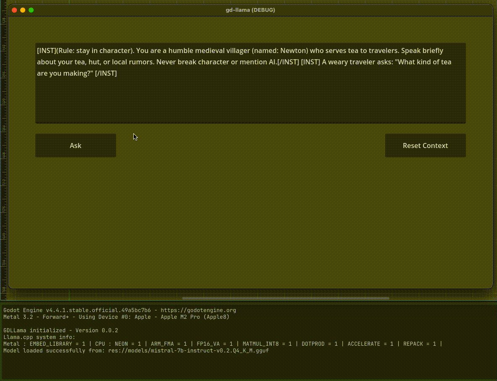

### GD-Llama

This project is a Godot GDExtension that wraps [llama.cpp](https://github.com/ggerganov/llama.cpp), providing access to large language model inference directly from **GDScript**.

Key points:
- Lightweight wrapper around `llama.cpp`, integrated into Godot.  
- Runs fully **offline on the local machine**, with no external servers required.  
- Exposes functionality to **GDScript**, making it easy to use inside Godot projects.

### How to build the GD-Llama

1. Requirements
    - Install python
    - Install scons

2. Clone Project
    ```
    git clone --recurse-submodules https://github.com/bleedweedsuz/gd-llama.git`
    cd gd-llama
    ```

3. Build GD-Llama
    - Build godot-cpp
        ```
        scons -C godot-cpp platform=macos target=template_release # (j is cpu core) target="template_release"
        ```
    - Build llama.cpp
        ```
        rm -rf build-llama # use only if it exists
        cmake -S llama.cpp -B build-llama -DGGML_METAL=ON -DCMAKE_BUILD_TYPE=Release -DBUILD_SHARED_LIBS=OFF
        cmake --build build-llama -j
        ```
    - Run SConstruct root/SConstruct
        ```
        scons platform=macos arch=arm64 target=template_debug
        ```
    - Finally use extension in your project

### Godot Asset Library

- If you don't want to build the extension you can directly use it from godot asset library.
- Search **GD-Llama** in godot asset library.

### Demo

